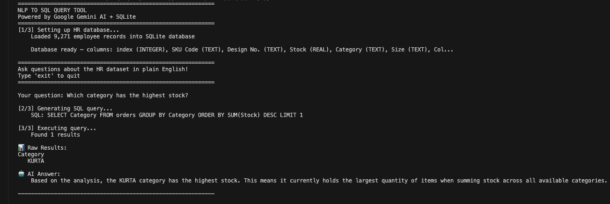
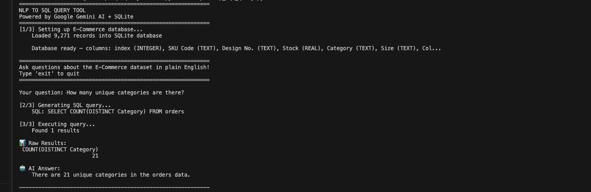

# NLP to SQL Query Tool

An AI-powered tool that converts plain English questions into SQL queries and returns answers as natural language insights — instantly.

---

##  Demo




---

## What It Does

Type a question in plain English → Google Gemini AI generates SQL → Executes on SQLite database → Returns answer in plain English.

---

## Project Overview

| Component | Tool |
|---|---|
| Natural Language Processing | Google Gemini AI |
| SQL Generation | Gemini API → SQLite |
| Data Storage | SQLite (9,271 records) |
| Data Processing | Python, Pandas |
| Dataset | E-Commerce Sales Dataset |

---

## Example Questions

```
Which category has the highest stock?
→ SQL: SELECT Category FROM orders GROUP BY Category ORDER BY SUM(Stock) DESC LIMIT 1
→ Answer: The KURTA category has the highest stock.

How many unique categories are there?
→ SQL: SELECT COUNT(DISTINCT Category) FROM orders
→ Answer: There are 21 unique categories.
```

---

## How To Run

1. Clone the repository
2. Install dependencies:
```bash
pip install google-genai pandas python-dotenv
```
3. Create `.env` file:
```
GEMINI_API_KEY=your_key_here
```
4. Add your CSV dataset to `data/` folder as `ecommerce_data.csv`
5. Run:
```bash
python scripts/nlp_sql_query.py
```

---

## Repository Structure

```
nlp-sql-query-tool/
│
├── data/
│   └── ecommerce_data.csv
│
├── scripts/
│   └── nlp_sql_query.py
│
├── .env                  (API key — not pushed to GitHub)
├── .gitignore
└── README.md
```

---

## Tools and Technologies

- **Python** — Pandas, SQLite3
- **Google Gemini AI** — NLP to SQL generation
- **SQLite** — lightweight database
- **GitHub** — version control

---

## Author

**Vinit Bhalerao**
Data Analyst | SQL | Python | Power BI | AI Analytics
[LinkedIn](https://www.linkedin.com/in/bhalerao-vinit3013) | [Portfolio](https://vinitbportfolio.netlify.app)